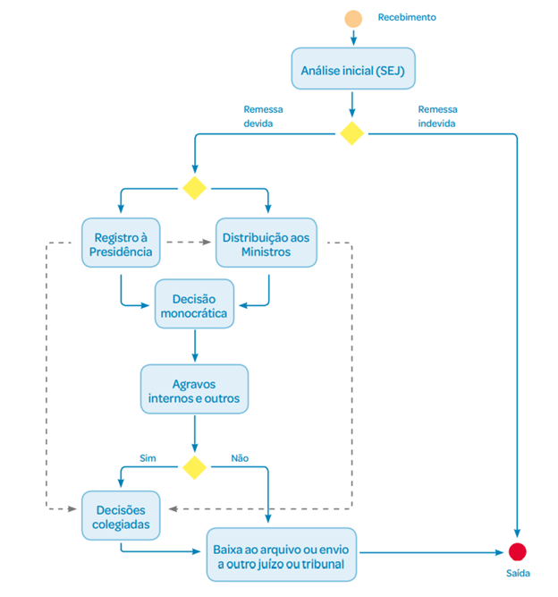

```{r, echo=FALSE}
# Script para logo na página
htmltools::img(src = knitr::image_uri(file.path("images", "logo.png")), 
               alt = 'logo', 
               style = 'position:absolute; top:0; right:0; padding:20px;')
```


```{r, results="asis", echo=FALSE, message=FALSE, warning=FALSE}
knitr::opts_chunk$set(echo = TRUE, fig.align = "center")

library(DT)
library(tidyverse)
library(scales)
library(patchwork)
library(tidyr)
library(ggrepel)
library(janitor)
```

# Resultados da Prestação Jurisdicional


```{r text, warning=TRUE, include=FALSE}
# Inserir periodo da análise
ano_atual <- 2021
ano_anterior <- ano_atual-1
data_tramitacao <- "16/12/2021"
fonte <- "Fonte: Portal de Informações Gerenciais em 16/12/2021 e Relatório de Atividades 2021."

# Leitura RDS -------------------------------------------------

tabela_acervo <- readRDS("../data_raw/tabela_acervo.rds")
acervo_autuacao <- readRDS("../data_raw/acervo_autuacao.rds")
tabela_rec_total <- readRDS("../data_raw/tabela_rec_total.rds")
decisoes2021 <- readRDS("../data_raw/decisoes2021.rds")
table_org <- readRDS("../data_raw/table_org.rds")
tabela_perc_total <- readRDS("../data_raw/tabela_perc_total.rds")
tabela_text_total <- readRDS("../data_raw/tabela_text_total.rds")
tabela_dec <- readRDS("../data_raw/tabela_dec.rds")
tabela_rec_baixa_total<- readRDS("../data_raw/tabela_rec_baixa_total.rds")
ramo_direito <- readRDS("../data_raw/ramo_direito.rds")
df_classes <- readRDS("../data_raw/df_classes.rds")
qtd_recursal_pres_min_2 <- readRDS("../data_raw/qtd_recursal_pres_min_2.rds")
prov_geral <- readRDS("../data_raw/prov_geral.rds")
tx_recorr <- readRDS("../data_raw/tabela_recorr_2021_total.rds")
recor_table_tipo <- readRDS("../data_raw/recor_table_tipo.rds")
decisoes_tipo_r <- readRDS("../data_raw/decisoes_tipo_r.rds")
acordaos <- readRDS("../data_raw/acordaos.rds")
text_total_col <- readRDS("../data_raw/text_total_col.rds")
tab_rg_final_1 <- readRDS(file = "../data_raw/tab_rg_final_1.rds")
tab_rg_final_2 <- readRDS(file="../data_raw/tab_rg_final_2.rds")
tab_rg_final_3 <- readRDS(file = "../data_raw/tab_rg_final_3.rds")


# Manipulações - texto ----------------------------------------

# Acervo - Selecionando as variáveis desejadas
text_acervo_2021 <- tabela_acervo |> 
  select(ano:acervo_total) |> 
  filter(ano %in% ano_atual) |> 
  mutate(perc_orig = paste0(round((originario/acervo_total*100),2),"%")) |>   mutate(perc_rec = paste0(round((recursal/acervo_total)*100,2), "%")) |> 
  mutate(eletronico = paste0(round((eletronico*100),2),"%"),
         fisico = paste0(round((fisico*100),2),"%")) # |> 
  # as.character()

# Redução/Aumento do acervo desde 2016
num_acervo <- round(((text_acervo_2021[6]-tabela_acervo$acervo_total[1])/tabela_acervo$acervo_total[1])*100,0)


# Diferença do acervo em comparação ao ano anterior
num_acervo2 <- tabela_acervo |> 
  select(ano:acervo_total) |> 
  filter(ano %in% c(ano_atual,ano_anterior))

text_num_acervo2 <- round(((num_acervo2$acervo_total[2]-num_acervo2$acervo_total[1])/num_acervo2$acervo_total[1])*100,0)

# Diferença recursal em comparação ao ano anterior
num_acervo3 <- round(((num_acervo2$recursal[2]-num_acervo2$recursal[1])/num_acervo2$recursal[1])*100,0)

# Redução/Aumento do recursal (acervo) desde 2016
num_acervo4 <- round(((text_acervo_2021[3]-tabela_acervo$recursal[1])/tabela_acervo$recursal[1])*100,0)


# Diferença fisico em comparação ao ano anterior
num_acervo5 <- round((num_acervo2$fisico[1]-num_acervo2$fisico[2])*100,4)


# Textual - Acervo
text_a1 <- num_acervo |> 
  mutate(acervo_total2 = if_else(acervo_total < 0, "uma redução de aproximadamente" , "um aumento de aproximadamente")) |> 
  mutate(paste0(acervo_total2, " ",abs(acervo_total), "%"))

text_a2 <- num_acervo2 |> 
  select(ano:acervo_total) |> 
  filter(ano %in% ano_atual) |> 
  mutate(acervo_total3 = if_else(text_num_acervo2 < 0, "uma redução em" , "um aumento de")) |> 
  mutate(paste0(acervo_total3, " ", abs(text_num_acervo2), "%")) 

text_a2_2 <- num_acervo2 |> 
  select(ano:acervo_total) |> 
  filter(ano %in% ano_atual) |> 
  mutate(acervo_total3 = if_else(text_num_acervo2 < 0, " menor do que" , " maior do que")) |> 
  mutate(paste0(abs(text_num_acervo2), "%", acervo_total3)) 

text_a3 <- tabela_acervo |> 
  select(ano,recursal) |> 
  filter(ano %in% ano_atual) |> 
  mutate(acervo_rec4 = if_else(num_acervo4 < 0, "uma redução em" , "um aumento de")) |> 
  mutate(paste0(acervo_rec4, " ", abs(num_acervo4), "%"))


# Acervo autuação - %

 acervo_autuacao_pct <- acervo_autuacao |>
   janitor::adorn_percentages("col") |> 
   mutate(n = round(n*100,1))
 
text_a4 <- round(acervo_autuacao_pct$n[4]-1)
 
text_a5 <- round(sum(acervo_autuacao_pct$n[-1]) ,0)


# Recebidos  - Selecionando as variáveis desejadas
text_recebidos_2021 <- tabela_rec_total |> 
  select(ano:RE) |> 
  filter(ano %in% ano_atual) |> 
  mutate(perc_orig = paste0(round((originario/recebidos*100),2),"%")) |>  
  mutate(perc_rec = paste0(round((recursal/recebidos)*100,2), "%"))  

# Presid. e ministros  - Selecionando as variáveis desejadas
text_pres_min_2021 <- tabela_text_total |> 
  select(ano:reg_presid_total) |> 
  filter(ano %in% ano_atual) |> 
  mutate(percent_presid = paste0(percent_presid,"%")) |>  
  mutate(percent_dist = paste0(percent_dist,"%"))

# Presid. e ministros - Recursal apenas
qtd_2_rec <- qtd_recursal_pres_min_2 |> 
  select(ano:dist_min_recursal) |> 
  filter(ano %in% ano_atual) |> 
  mutate(mes_presid = round(reg_presid_recur/12,0),
         mes_min = round(dist_min_recursal/12,0))


# Decisões - Selecionando as variáveis desejadas
decisoes <- tabela_dec |> 
  select(ano:decisoes_colegiadas) |> 
  filter(ano %in% ano_atual) |> 
  mutate(perc_mono = paste0(round((decisoes_monocraticas/total_decisoes*100),2),"%")) |>  
  mutate(perc_col = paste0(round((decisoes_colegiadas/total_decisoes)*100,2), "%")) 


# Decisões colegiadas - em relação ao ano anterior
decisoes_col <- tabela_dec |> 
  select(ano,decisoes_colegiadas) |> 
  filter(ano %in% c(ano_atual,ano_anterior)) 

perc_colegiadas <- round((decisoes_col$decisoes_colegiadas[2]-decisoes_col$decisoes_colegiadas[1])/decisoes_col$decisoes_colegiadas[1]*100,2)

text_colegiadas <- tabela_dec |> 
  select(ano,decisoes_colegiadas) |> 
  filter(ano %in% ano_atual) |> 
  mutate(col1 = if_else(perc_colegiadas < 0, "Houve uma diminuição de ", "Houve um aumento de ")) |> 
  mutate(col2 = if_else(perc_colegiadas < 0, ".", ", reforçando o princípio da Colegialidade.")) |> 
  mutate(col1 = paste0(col1, abs(perc_colegiadas), "%", " nas decisões colegiadas", col2))


# Baixa - Selecionando as variáveis desejadas
baixas <- tabela_rec_baixa_total |> 
  select(ano:baixa) |> 
  filter(ano %in% c(ano_atual,ano_anterior))


# Baixas
baixas_proc <- as.numeric(baixas$baixa)
perc_baixa <- round((((baixas_proc[2]-baixas_proc[1])/baixas_proc[1]))*100,2)

text_baixa1 <- baixas |> 
  select(ano,recebimento) |> 
  filter(ano %in% ano_atual) |> 
  mutate(baixa_1 = if_else(perc_baixa < 0, "a redução foi de" , "o aumento foi de")) |> 
  mutate(paste0(baixa_1, " ", abs(perc_baixa), "%"))


# Recebimento 
text_recebimentos <- tabela_rec_baixa_total |> 
  select(ano:baixa) |> 
  filter(ano %in% ano_atual) |> 
  as.numeric()

percent_receb_baixa <- round((((text_recebimentos[3]-text_recebimentos[2])/text_recebimentos[2]))*100,2)

text_baixa2 <- baixas |> 
  select(ano,recebimento) |> 
  filter(ano %in% ano_atual) |> 
  mutate(baixa_3 = if_else(percent_receb_baixa < 0, " menor do que o número de recebidos" , " maior do que o número de recebidos")) |> 
  mutate(paste0(abs(percent_receb_baixa), "%", baixa_3))


# Texto - Recebimento em relação ao ano anterior 
receb_text <- as.numeric(baixas$recebimento)
perce_text_recb <- round((receb_text[2]-receb_text[1])/receb_text[1]*100,2)

text_receb_3 <- baixas |> 
  select(ano,recebimento) |> 
  filter(ano %in% ano_atual) |>
  mutate(baixa_5 = if_else(perce_text_recb < 0, " a redução foi de " , " o aumento foi de ")) |> 
  mutate(paste0(baixa_5, abs(perce_text_recb), "%"))
  

text_rec <- tabela_rec_baixa_total |> 
  select(ano:acervo_final) |> 
  filter(ano %in% c(ano_atual,ano_anterior)) 

# Diferença recebimento em comparação ao ano anterior
vet_receb <- as.numeric(text_rec$recebimento)
perc_rec <- round(((vet_receb[2]-vet_receb[1])/vet_receb[1])*100,2)

text_r1 <- text_rec |> 
  select(ano,recebimento) |> 
  filter(ano %in% ano_atual) |> 
  mutate(receb_1 = if_else(perc_rec < 0, "uma queda de" , "um aumento de")) |> 
  mutate(paste0(receb_1, " ", abs(perc_rec), "%"))

# Taxa de produtividade - texto
produtiv <- tabela_rec_baixa_total |> 
  select(ano:taxa_produtiv) |> 
  filter(ano %in% ano_atual)


# Diferença do recursal (recebidos) em comparação ao ano anterior
text_rec2 <- tabela_rec_total |> 
  select(ano:RE) |> 
  filter(ano %in% c(ano_atual,ano_anterior))

# Por classe recursal - ARE
perc_rec_are <- round(((text_rec2$ARE[2]-text_rec2$ARE[1])/text_rec2$ARE[1])*100,1)

are_text <- tabela_rec_total |> 
  select(ano,ARE) |> 
  filter(ano %in% ano_atual) |> 
  mutate(are_1 = if_else(perc_rec_are < 0, "Redução percentual de" , "Um aumento percentual de")) |> 
  mutate(paste0(are_1, " ", abs(perc_rec_are), "%"))


# Por classe recursal - RE  
perc_rec_re <- round(((text_rec2$RE[2]-text_rec2$RE[1])/text_rec2$RE[1])*100,1)

re_text <- tabela_rec_total |> 
  select(ano,RE) |> 
  filter(ano %in% ano_atual) |> 
  mutate(re_1 = if_else(perc_rec_re < 0, "redução de aproximadamente" , "um aumento de aproximadamente")) |> 
  mutate(paste0(re_1, " ", abs(perc_rec_re), "%"))


# Originário
perc_orig <- round(((text_rec2$originario[2]-text_rec2$originario[1])/text_rec2$originario[1])*100,1)

orig_text <- tabela_rec_total |> 
  select(ano,originario) |> 
  filter(ano %in% ano_atual) |> 
  mutate(orig_1 = if_else(perc_orig < 0, "redução substancial de" , "aumento substancial de")) |> 
  mutate(paste0(orig_1, " ", abs(perc_orig), "%"))


perc_recursal_total <- round(((text_rec2[[2,4]]-text_rec2[[1,4]])/text_rec2[[1,4]])*100,2)

text_r2 <- tabela_rec_total |> 
  select(ano,recursal) |> 
  filter(ano %in% ano_atual) |> 
  mutate(receb_2 = if_else(perc_recursal_total < 0, "Uma diminição de" , "Um aumento de")) |> 
  mutate(paste0(receb_2, " ", abs(perc_recursal_total), "%"))


# Recursos a mais/a menos
text_r3 <- text_rec2[[2,4]]-text_rec2[[1,4]]

text_r4 <- text_rec2 |> 
  select(ano,recursal) |> 
  filter(ano %in% ano_atual) |> 
  mutate(receb_3 = if_else(text_r3 < 0, "a menos" , "a mais"))


# Provimento
prov_last_year <- prov_geral |> 
  select(ano:re_prov) |> 
  filter(ano %in% ano_atual)
  

# Tabela - Texto monocráticas/colegiadas por presid/ministros 

text_total <-  decisoes2021 |> 
  filter(tipo_decisao == "MONOCRÁTICA") |>
  summarise(n = sum(qtd_ocorrencias_processuais))

presid_mono <-  decisoes2021 |> 
     group_by(orgao_julgador) |> 
    filter(tipo_decisao == "MONOCRÁTICA") |>
    filter(orgao_julgador == "PRESIDÊNCIA") |> 
    summarise(n = sum(qtd_ocorrencias_processuais))

percent_pres_mono = round((presid_mono$n/text_total$n)*100,2)


# Texto - Recorribilidade - Geral

text_recor <- tx_recorr |> 
  select(ano:taxa_rec) |> 
  filter(ano %in% ano_atual) |> 
  mutate(percent_rec = paste0(taxa_rec,"%"))  
  

# Texto - Recorribilidade - orginiário e recursal 

rec_total <-  recor_table_tipo  |>
  group_by(tipo) |>
  summarise(n = sum(qtd_ocorrencias_processuais)) 


# Total de decisões - originario x recursal

dec_total_r <-  decisoes_tipo_r |>
  group_by(tipo) |>
  summarise(n = sum(qtd_ocorrencias_processuais)) 

taxa_recorr <- round((rec_total$n/dec_total_r$n)*100,1)

perc <- cbind(rec_total$tipo,taxa_recorr)


# Total - Por órgão - Colegiado
text_orgao3 <- text_total_col |>
  group_by(orgao_julgador3) |>
  filter(tipo_decisao == "COLEGIADA") |>
  filter(orgao_julgador3 %in% c("Turmas", "Plenário")) |>
  summarise(n = sum(qtd_ocorrencias_processuais)) |> 
  mutate(percent_orgao3 = round(n/sum(n),4)*100)
  

```


Dos `r as.character(text_acervo_2021[6])` processos em tramitação, `r as.character(text_acervo_2021[2])` (`r as.character(text_acervo_2021[7])`) são originários e `r as.character(text_acervo_2021[3])` (`r as.character(text_acervo_2021[8])`) são recursais. Dos processos recebidos, `r as.character(text_recebidos_2021[3])` (`r as.character(text_recebidos_2021[8])`) são originários e `r as.character(text_recebidos_2021[4])` (`r as.character(text_recebidos_2021[9])`) são recursais. Ainda sobre os processos recebidos, `r as.character(text_pres_min_2021[5])` (`r as.character(text_pres_min_2021[2])`) foram registrados à presidência, com média mensal de `r round(text_pres_min_2021[5]/12,0)` processos e `r as.character(text_pres_min_2021[4])` (`r as.character(text_pres_min_2021[3])`) processos foram distribuídos aos ministros, com média mensal de `r round(text_pres_min_2021[4]/12,0)` processos. Isto significa uma média mensal de aproximadamente `r round((text_pres_min_2021[4]/12)/10,0)` processos por mês por Ministro.

Em relação às decisões, contabilizou-se `r as.character(decisoes[[3]])`, sendo `r as.character(decisoes[[4]])` (`r as.character(decisoes[[6]])`) monocráticas e `r as.character(decisoes[[5]])` (`r as.character(decisoes[[7]])`) colegiadas. O número de processos baixados (`r as.character(baixas$baixa[2])`) foi `r text_baixa2[[1,4]]`. Em relação ao ano anterior,`r text_receb_3[[1,4]]` da quantidade de recebimento.


## Acervo Processual

O acervo geral do STF corresponde ao quantitativo de processos em tramitação no dia `r data_tramitacao`, computados os registrados à presidência e distribuídos aos ministros. Em `r ano_atual`, o Tribunal registrou o menor acervo processual dos últimos 22^[O [Relatório de atividades do biênio 2004 a 2006 ](http://www.stf.jus.br/arquivo/cms/centralDoCidadaoAcessoInformacaoGestaoEstrategica/anexo/Relatorio_de_Atividades_2004_a_2006.pdf) mostra dados do ano de 2000 que demonstram que haviam pelo menos 127 mil processos sem setença. O Relatório de Gestão de 2020 do Ministro Dias Tofolli apresenta a informação que seria nos últimos 24 anos e precisaria ser levantado junto à SAE em relatórios anteriores.] anos, com `r as.character(text_acervo_2021[6])` processos em tramitação. Desde 2016 a corte acumula `r text_a1[3]` no acervo geral.


```{r grafico1, echo=FALSE, warning=FALSE}

tabela_acervo  |>
  ggplot(aes(x = ano, y = acervo_total)) +
  geom_label(aes(label = acervo_total),
            position = position_stack(vjust = 1.1))+
  ggtitle("Acervo processual") +
  geom_area(fill = 4, color = 'grey', alpha = 0.5)+
  labs(caption = fonte) +
  scale_fill_brewer(palette = "Blues") +
  ggthemes::theme_fivethirtyeight()+
  #coord_cartesian(ylim = c(0, 60000))+
  theme(axis.title.y=element_blank(),
        axis.text.y=element_blank(),
        axis.ticks.y=element_blank())

 
```

Os gráficos abaixo mostram a evolução dos processos originários e recursais, desde 2016. Houve `r as.character(text_a2[8])` no acervo de `r ano_anterior` para `r ano_atual`.

```{r grafico2, echo=FALSE, warning=FALSE}

acervo_orig_rec <-
tabela_acervo |> 
  select(ano:recursal) |> 
  pivot_longer(
    cols = originario:recursal,
    names_to = "classificacao",
    values_to = "qtd"
  )


acervo_orig_rec |> 
  ggplot(aes(x = ano, y = qtd, 
             fill= fct_reorder(classificacao, qtd, .desc = TRUE)), position = "identity")+
  ggtitle("Originários e recursais") +
  geom_area(color = 'grey') +
  labs(caption = fonte) +
  scale_fill_brewer(palette = "Blues") +
  ggthemes::theme_fivethirtyeight()+
  theme(axis.title.y=element_blank(),
        axis.text.y=element_blank(),
        legend.title = element_blank(),
        axis.ticks.y=element_blank()) +
  geom_text(aes(label = qtd),
            position = position_stack(vjust = 1.1))


```


Historicamente há uma certa estabilidade em relação aos processos originários. Para os recursais, no entanto, há uma expressiva redução no acervo de magnitude de `r text_a3[4]` em relação a 2016, e de `r abs(num_acervo3)`% com relação a `r ano_anterior`.

```{r grafico3, echo=FALSE, warning=FALSE}
# OK - 2021

autuacao_levels = c('Anterior a 2017', '2017 a 2018', '2019 a 2020', '2021')


acervo_autuacao |> 
  ggplot2::ggplot(aes(y = clas_ano_autuacao, x = n)) +
  geom_bar(aes(fill = autuacao_levels), color = 'black', stat = "identity",show.legend = FALSE) +
  geom_label(aes(label=n))+
  ggtitle("Acervo por ano de autuação") +
  labs(caption = fonte)+
  scale_fill_brewer(palette = "Blues") +
  ggthemes::theme_fivethirtyeight() +
  theme(axis.title.x=element_blank(),
        axis.text.x=element_blank(),
        axis.ticks.x=element_blank())

```

Mais de `r as.character(text_a4)`% dos processos do acervo têm menos de 1 ano de autuação.
Aproximadamente `r as.character(text_a5)`% do acervo é composto por feitos autuados nos últimos 5 anos. Estes resultados demonstram o compromisso do STF com a redução do acervo de processos antigos e o alcance da meta do Indicador de Processos Antigos.

```{r text_ramo, warning=FALSE, include=FALSE}

text_ramo <- paste0("Com relação ao Ramo do Direito, 
                    a categoria ", 
                    str_to_title(ramo_direito[[1,1]]),
                    ' corresponde a ',
                    str_to_title(ramo_direito[[1,3]]),
                    ' do total, seguida por ',
                    str_to_title(ramo_direito[[2,1]]),
                    ' (', str_to_title(ramo_direito[[2,3]],),
                    ')', ' e ', 
                    str_to_title(ramo_direito[[3,1]]),
                    ' (', str_to_title(ramo_direito[[3,3]]),').')
```

`r text_ramo`

```{r tabela2, echo=FALSE, warning=FALSE}

# Organizando nome da coluna
colnames(ramo_direito) <- c("Ramo do direito", "Quantidade de processos", "% do total")

    DT::datatable(
  ramo_direito, extensions = 'Buttons', options = list(
    dom = 'Bfrtip',
    buttons = c('copy', 'csv', 'excel', 'pdf', 'print','colvis'), pageLength = 16
  )
)

```

Por fim, a tramitação por meio eletrônico corresponde a `r text_a2[[4]]*100`% do acervo de `r ano_atual`, conforme gráfico a seguir.

```{r grafico4, echo=FALSE, , warning=FALSE}
# OK - 2021

acervo_eletro_fis <-
tabela_acervo |> 
  select(ano, eletronico:fisico) |> 
  pivot_longer(
    cols = eletronico:fisico,
    names_to = "tipo",
    values_to = "qtd"
  )


acervo_eletro_fis |> 
  ggplot(aes(x = ano, y = qtd, group=factor(tipo))) +
  geom_point() + 
  geom_line(aes(y = qtd, shape=tipo, fill = factor(tipo), colour=tipo)) +
  geom_label(aes(label = paste0(round(qtd,3)*100,"%"))) +
  ggtitle("Acervo Físico x Eletrônico") +
  labs(caption = fonte)+
  coord_cartesian(ylim = c(-0.2, 1.2))+
  scale_fill_brewer(palette = "Blues") +
  ggthemes::theme_fivethirtyeight()+
    theme(axis.title.y=element_blank(),
        axis.text.y=element_blank(),
        legend.title = element_blank(),
        axis.ticks.y=element_blank())


```


Desde 2013 a tramitação eletrônica supera a física. O esforço para a digitalização do acervo, uma das diretrizes estratégicas da corte, decorre da implantação de novas tecnologias e sistemas de automação. Em relação a `r ano_anterior` houve diminuição de mais `r abs(num_acervo5)`% dos processos físicos, resultado que corrobora a visão da Gestão de um STF 100% Digital.

## Recebimento

De modo geral, o fluxo de tramitação processual no STF ocorre nas macro etapas a seguir apresentadas

<center>



</center>


O processamento começa com o recebimento, autuação e análise inicial do processo pela SEJ. Consideram-se recebidos os processos ajuizados diretamente no STF, denominados "Originários" e os provenientes de outros juízos ou tribunais, chamados de "Recursais".

### Recebimento Geral

Em `r ano_atual`, o STF recebeu `r text_rec$recebimento[2]` processos,  `r text_r1[[4]]` em relação ao ano de `r ano_anterior`.

```{r grafico5, echo=FALSE, warning=FALSE, fig.height=4, fig.width=7}
# 2021 - OK
# Dados RDS

dados <-
  structure(list(Ano = tabela_rec_total$ano, 
Processos = c(tabela_rec_total$recebidos)), 
            class = "data.frame", row.names = c(NA, -6L))

dados$Ano <- factor(dados$Ano, levels = unique(dados$Ano))

ggplot(dados, aes(x = Ano, y = Processos)) +
  geom_bar(aes(fill = Ano), binwidth = 1, color = 'black', stat = "identity", show.legend = FALSE) + 
  ggtitle("Processos Recebidos") +
  labs(caption = fonte)+
  geom_label(aes(label = Processos),
             position = position_dodge(0.9), 
             vjust = 0.5, size = 3.5, hjust = 0.5)+
  scale_fill_brewer(palette = "Blues") +
  ggthemes::theme_fivethirtyeight()+
    theme(axis.title.y=element_blank(),
        axis.text.y=element_blank(),
        axis.ticks.y=element_blank(),
        panel.grid.major = element_blank(),
      panel.grid.minor = element_blank())

```


Uma vez recebidos, os processos são autuados pela SEJ, com posterior registro à Presidência ou distribuição aos Ministros. `r text_pres_min_2021[[2]]` dos processos recebidos foram registrados à Presidência. A ampliação da atuação da presidência pode ser observada nos gráficos a seguir, que mostram o percentual e a quantidade de registros, respectivamente:

```{r grafico6, echo=FALSE, warning=FALSE}
# OK - 2021
tab_percent_total <- tabela_perc_total

colnames(tab_percent_total)[2] <- "Registrados à Presidência"
colnames(tab_percent_total)[3] <- "Distribuídos aos Ministros"

percent_total <-
tab_percent_total |> 
  select(ano, 2:3) |> 
  pivot_longer(
    cols = 2:3,
    names_to = "destino",
    values_to = "qtd"
  )

percent_total |> 
  ggplot(aes(x = ano, y = qtd, group=factor(destino))) +
  geom_point() + 
  geom_line(aes(y = qtd, shape=destino, fill = factor(destino), colour=destino)) +
  geom_label_repel(aes(label = paste0(round(qtd,3),"%")), vjust = 0.5, hjust = 0.2) +
  labs(caption = fonte) +
  coord_cartesian(ylim = c(25, 73))+
  scale_fill_brewer(palette = "Blues") +
  ggthemes::theme_fivethirtyeight() +
    theme(axis.title.y=element_blank(),
        axis.text.y=element_blank(),
        legend.title = element_blank(),
        axis.ticks.y=element_blank()
       )


```

```{r grafico7, echo=FALSE, warning=FALSE}
# OK - 2021
qtd_total_pres_min <- readRDS("../data_raw/qtd_total_pres_min.rds")

colnames(qtd_total_pres_min)[2] <- "Registrados à Presidência"
colnames(qtd_total_pres_min)[3] <- "Distribuídos aos Ministros"

qtd_total <-
qtd_total_pres_min |> 
  select(ano, 2:3) |> 
  pivot_longer(
    cols = 2:3,
    names_to = "destino",
    values_to = "qtd"
  )


qtd_total |> 
  ggplot(aes(x = ano, y = qtd, group=factor(destino))) +
  geom_point() + 
  geom_line(aes(y = qtd, shape=destino, fill = factor(destino), colour=destino)) +
  geom_label_repel(aes(label = qtd), hjust = 0.5, size = 3) +
  labs(caption = fonte) +
   scale_fill_brewer(palette = "Blues") +
  ggthemes::theme_fivethirtyeight() +
    theme(axis.title.y=element_blank(),
        axis.text.y=element_blank(),
        legend.title = element_blank(),
        axis.ticks.y=element_blank()
       )

```


A soma dos processos distribuídos aos ministros e registrados à presidência não coincide com o total de processos recebidos. Essa diferença corresponde às seguintes situações: (a) processos recebidos mas ainda não distribuídos ou registrados; (b) retificações de autuações (processos repetidos --- duplicados, triplicados etc. ---, cujas cópias são baixadas à origem); e (c) inconformidades para tramitação (por exemplo: processos indevidamente remetidos ao STF, processos sem peças suficientes para a autuação ou remetidos mais de uma vez ao Tribunal).

### Recebimento de Recursos

Ao se analisar apenas as classes recursais (ARE/RE/AI), constata-se que, em `r ano_atual`, o STF recebeu `r as.character(text_rec2[[2,4]])` recursos, cerca de `r text_rec2[[2,4]]-text_rec2[[1,4]]` `r text_r4[[1,3]]` em relação ao ano anterior. `r text_r2[[1,4]]`.

Ressalta-se que o Regimento Interno do STF atribui ao Presidente a competência de decidir os recursos manifestamente inadmissíveis. Essa atividade vem se sofisticando ao longo dos anos e alcançou nível de refinamento que permite o julgamento da maior parte dos recursos.

Os dois gráficos a seguir mostram, respectivamente, os percentuais e quantidades de recursos registrados à presidência e distribuídos aos ministros.


```{r grafico8, echo=FALSE, warning=FALSE}
# OK - 2021

qtd_recursal_pres_min <- readRDS("../data_raw/qtd_recursal_pres_min.rds")

colnames(qtd_recursal_pres_min)[2] <- "Registrados à Presidência"
colnames(qtd_recursal_pres_min)[3] <- "Distribuídos aos Ministros"

recursal_pres_min <-
qtd_recursal_pres_min |> 
  select(ano, 2:3) |> 
  pivot_longer(
    cols = 2:3,
    names_to = "destino",
    values_to = "qtd"
  )


recursal_pres_min |> 
  ggplot(aes(x = ano, y = qtd, group=factor(destino))) +
  geom_point() + 
  geom_line(aes(y = qtd, shape=destino, fill = factor(destino), colour=destino)) +
  geom_label(aes(label = paste0(round(qtd,3),"%"))) +
  labs(caption = fonte) +
 # coord_cartesian(ylim = c(25, 73))+
  scale_fill_brewer(palette = "Blues") +
  ggthemes::theme_fivethirtyeight() +
    theme(axis.title.y=element_blank(),
        axis.text.y=element_blank(),
        legend.title = element_blank(),
        axis.ticks.y=element_blank()
       )


```


```{r grafico9, echo=FALSE, warning=FALSE}
# OK - 2021
qtd_recursal_pres_min_2 <- readRDS("../data_raw/qtd_recursal_pres_min_2.rds")

colnames(qtd_recursal_pres_min_2)[2] <- "Registrados à Presidência"
colnames(qtd_recursal_pres_min_2)[3] <- "Distribuídos aos Ministros"

qtd_recur_pres_min <-
qtd_recursal_pres_min_2 |> 
  select(ano, 2:3) |> 
  pivot_longer(
    cols = 2:3,
    names_to = "destino",
    values_to = "qtd"
  )


qtd_recur_pres_min |> 
  ggplot(aes(x = ano, y = qtd, group=factor(destino))) +
  geom_point() + 
  geom_line(aes(y = qtd, shape=destino, fill = factor(destino), colour=destino)) +
  geom_label_repel(aes(label = qtd), vjust = 0.5, size = 3) +
  labs(caption = fonte) +
   scale_fill_brewer(palette = "Blues") +
  ggthemes::theme_fivethirtyeight() +
    theme(axis.title.y=element_blank(),
        axis.text.y=element_blank(),
        legend.title = element_blank(),
        axis.ticks.y=element_blank()
       )

```


Este significativo avanço da atuação da Presidência na esfera recursal é resultado da implementação do projeto estratégico Juízo de Admissibilidade, que ampliou a atuação do Núcleo de Análise de Recursos (NARE) e do Núcleo de Repercussão Geral (NURG), no âmbito da Presidência, e de setores especializados na SEJ. Essas unidades são responsáveis pela apreciação de recursos manifestamente inadmissíveis ou inaptos, bem como pela aplicação da sistemática da repercussão geral.

Outra atividade significativa foi o avanço na interlocução com os tribunais de origem contribuiu para essa significativa diminuição no recebimento de processos. Através de uma agenda de visitas institucionais que tinha como objetivo alinhamento institucional, cooperação, integração e valorização dos tribunais foi possui manter comunicação direta. A partir deste contato surgiram os cursos de capacitação que visavam o aperfeiçoamento do juízo de admissibilidade, a consolidação da sistemática da repercussão geral, afetação de representativos de controvérsia e redução de envio de recursos inaptos
ao STF.

Os dois gráficos a seguir mostram a evolução dos processos recebidos em classes recursais apenas para o ano de `r ano_atual`. Desse total, foram registrados à Presidência por mês `r qtd_2_rec$mes_presid`, em média. Foram distribuídos aos Ministros `r qtd_2_rec$mes_min` processos por mês, em média, no mesmo período.

```{r grafico10, echo=FALSE, warning=FALSE}
# OK - 2021

recebidos_recursais <- 
tabela_rec_total |> 
  select(ano,ARE:RE) |> 
  pivot_longer(
    cols = ARE:RE,
    names_to = "recursais",
    values_to = "qtd"
  )


recebidos_recursais |> 
  ggplot(aes(x = ano, y = qtd, 
             fill= fct_reorder(recursais, qtd, .desc = TRUE)), position = "identity")+
  ggtitle("Recebidos - ARE, AI e RE") +
  geom_area(color = 'grey') +
  labs(caption = fonte)+
  scale_fill_brewer(palette = "Blues") +
  ggthemes::theme_fivethirtyeight()+
  theme(axis.title.y=element_blank(),
        axis.text.y=element_blank(),
        legend.title = element_blank(),
        axis.ticks.y=element_blank()) +
    geom_text(aes(label = qtd),position = position_stack(vjust = 1.1), size=3)

```


```{r grafico11, echo=FALSE, warning=TRUE}
# OK - 2021

dados <- data.frame(Processos = factor(df_classes$class_names), 
                       Proporção = df_classes$total_perc)

dados <- dados %>% 
  mutate(Ano = "2021")

ggplot(dados, aes(x = Ano, y = Proporção, fill = Processos)) +
  geom_col() +
  labs(caption = fonte)+
  geom_text(aes(label = paste0(Proporção, "%")),
            position = position_stack(vjust = 0.5)) +
  scale_fill_brewer(palette = "Blues") +
  ggthemes::theme_fivethirtyeight()+
  theme(legend.title = element_blank(),
        axis.ticks.y=element_blank())+
  coord_flip()+
  xlab(NULL)+
  ylab("2021")


```


`r are_text[[4]]` em recebimentos de ARE com relação a `r ano_anterior` e `r re_text[[4]]` de recebimento de RE.</mark>


Conforme relatório sobre a taxa de provimento, as decisões dos tribunais de origem são confirmadas pelo Supremo em `r  as.character(prov_last_year[[2]])`% dos casos. A taxa de provimento por classes é de `r prov_last_year[[4]]`% para ARE e `r as.character(prov_last_year[[5]])`% para RE.

```{r grafico12, echo=FALSE, warning=FALSE}

names_provimento <- prov_geral

colnames(names_provimento)[2] <- "Taxa de provimento"
colnames(names_provimento)[3] <- "Taxa de não provimento"

graph_provimento <-
  names_provimento |> 
  select(1:3) |> 
  pivot_longer(
    cols = 2:3,
    names_to = "tipo",
    values_to = "qtd"
  )

graph_provimento |> 
  ggplot(aes(x = ano, y = qtd, group=factor(tipo))) +
  geom_point() + 
  geom_line(aes(y = qtd, shape=tipo, fill = factor(tipo), colour=tipo), size=0.8) +
  geom_label(aes(label = paste0(round(qtd,2),"%"),vjust = -1)) +
  ggtitle("Taxa de provimento de decisões") +
  labs(caption = fonte)+
  coord_cartesian(ylim = c(-2, 110))+
  scale_x_continuous(breaks = 2010:2021) +
  scale_fill_brewer(palette = "Blues") +
  ggthemes::theme_fivethirtyeight()+
  theme(axis.title.y=element_blank(),
        axis.text.y=element_blank(),
        legend.title = element_blank(),
        axis.ticks.y=element_blank())

```


<!-- [TABELA RETIRADA] - SOMENTE VERSAO FINAL - Dos recursos apresentados à Presidência aproximadamente <mark>90%</mark> dos óbices -->
<!-- eram relacionados aos seguintes motivos: -->

<!-- <center><span class="border-highlight"><b>Tabela 3 - Motivo inaptidão - Euler </center> </span></b> -->

### Recebimento de Originários 

Em `r ano_atual`, o STF recebeu `r as.character(text_recebidos_2021[[3]])` processos originários. É possível notar, no gráfico a seguir, `r orig_text[[4]]` em relação ao ano anterior.

```{r grafico13, echo=FALSE, warning=FALSE, fig.height=4, fig.width=7}
# 2021 - OK
# Dados RDS

dados <-
  structure(list(Ano = tabela_rec_total$ano, 
Processos = c(tabela_rec_total$originario)), 
            class = "data.frame", row.names = c(NA, -6L))

dados$Ano <- factor(dados$Ano, levels = unique(dados$Ano))

ggplot(dados, aes(x = Ano, y = Processos)) +
  geom_bar(aes(fill = Ano), binwidth = 1, color = 'black', stat = "identity",show.legend = FALSE) + 
  ggtitle("Processos originários") +
  labs(caption = fonte)+
  geom_label(aes(label = Processos),
             position = position_dodge(0.9), 
             vjust = 0.5, size = 3.5, hjust = 0.5)+
  scale_fill_brewer(palette = "Blues") +
  ggthemes::theme_fivethirtyeight()+
    theme(axis.title.y=element_blank(),
        axis.text.y=element_blank(),
        axis.ticks.y=element_blank(),
        panel.grid.major = element_blank(),
      panel.grid.minor = element_blank())

```


Para o ano de `r ano_atual`, temos, em bases percentuais:

```{r grafico14, echo=FALSE, warning=FALSE}
# OK - 2021
grafico_classes <- readRDS("../data_raw/grafico_classes.rds")

dados <- data.frame(Processos = factor(grafico_classes$grupo_de_classe), 
                       Proporção = grafico_classes$percent_classes)

dados <- dados %>% 
  mutate(Ano = "2021")

ggplot(dados, aes(x = Ano, y = Proporção, fill = Processos)) +
  geom_col() +
  labs(caption = fonte)+
  geom_text(aes(label = paste0(Proporção, "%")),
            position = position_stack(vjust = 0.5)) +
  scale_fill_brewer(palette = "Blues") +
  ggthemes::theme_fivethirtyeight()+
  theme(legend.title = element_blank(),
        axis.ticks.y=element_blank())+
  coord_flip()+
  xlab(NULL)+
  ylab("2021")


```


A tabela a seguir mostra o recebimento de processos originários por classe:

```{r orig_classe, echo=FALSE, warning=FALSE}

# Dados RDS
tab_total_class <- readRDS("../data_raw/tab_total_class.rds")

# Organizando nome da coluna
colnames(tab_total_class) <- c("Classe originária", "Grupo","2016","2017","2018","2019","2020","2021")

    DT::datatable(
  tab_total_class, extensions = 'Buttons', options = list(
    dom = 'Bfrtip',
    buttons = c('copy', 'csv', 'excel', 'pdf', 'print','colvis'), pageLength = 40
  )
)

```


## Julgamentos 

O julgamento do processo é identificado pela decisão final, a qual extingue o processo ainda que o mérito da causa não seja apreciado. É o que ocorre, por exemplo, nas decisões de não conhecimento, de prejudicialidade, de homologação de desistência e de negativa de seguimento. Se houver decisão final no processo e decurso do prazo processual sem interposição de recurso, ocorrerá o trânsito em julgado da decisão e, subsequentemente, a baixa do processo. No mais, destaca-se que é possível a cumulação de mais de uma decisão em cada feito. O gráfico a seguir mostra a quantidade de decisões e a quantidade de decisões finais.

```{r grafico15, echo=FALSE, warning=FALSE}

names_graph_decisoes <- tabela_dec

colnames(names_graph_decisoes)[2] <- "Decisão Final"
colnames(names_graph_decisoes)[3] <- "Total de decisões"


graph_decisoes <-
  names_graph_decisoes |> 
  select(1:3) |> 
  pivot_longer(
    cols = 2:3,
    names_to = "decisoes",
    values_to = "qtd"
  )


graph_decisoes |> 
  ggplot(aes(x = ano, y = qtd, 
             fill= fct_reorder(decisoes, qtd, .desc = TRUE)), position = "identity")+
  geom_area(color = 'grey') +
  labs(caption = fonte)+
  scale_fill_brewer(palette = "Blues") +
  ggthemes::theme_fivethirtyeight()+
  theme(axis.title.y=element_blank(),
        axis.text.y=element_blank(),
        legend.title = element_blank(),
        axis.ticks.y=element_blank()) +
  geom_text(aes(label = qtd),
            position = position_stack(vjust = 1.1), size=3)


```


Além da decisão final, há outras espécies em menor quantidade, conforme apresentado na tabela seguinte com os respectivos quantitativos.


```{r decisoes_especie, echo=FALSE, warning=FALSE}
# OK - 2021
# Dados RDS
tabela_dec_especies_2021 <- readRDS("../data_raw/tabela_dec_especies_2021.rds")

# Organizando nome da coluna
colnames(tabela_dec_especies_2021)[1] <- "Decisões por espécie"

    DT::datatable(
  tabela_dec_especies_2021, extensions = 'Buttons', options = list(
    dom = 'Bfrtip',
    buttons = c('copy', 'csv', 'excel', 'pdf', 'print','colvis')
  )
)

```


Ademais, as decisões podem ser classificadas em monocráticas (`r as.character(decisoes[[6]])`) e colegiadas (`r as.character(decisoes[[7]])`). Entre as monocráticas, `r as.character(100-percent_pres_mono)`% foram decisões proferidas por Ministros e `r as.character(percent_pres_mono)`% pelo Ministro Presidente. Entre as decisões colegiadas, cerca de `r text_orgao3$percent_orgao3[[2]]`% foram proferidas pelas turmas e `r text_orgao3$percent_orgao3[[1]]`% pelo Plenário. `r text_colegiadas$col1` Os gráficos a seguir mostram o quantitativo de decisões monocráticas e colegiadas por ano.


```{r grafico16, echo=FALSE, warning=FALSE, fig.height=4, fig.width=7}
# 2021 - OK
# Dados RDS

dados <-
  structure(list(Ano = tabela_dec$ano, 
Processos = c(tabela_dec$decisoes_monocraticas)), 
            class = "data.frame", row.names = c(NA, -6L))

dados$Ano <- factor(dados$Ano, levels = unique(dados$Ano))

ggplot(dados, aes(x = Ano, y = Processos)) +
  geom_bar(aes(fill = Ano), binwidth = 1, color = 'black', stat = "identity", show.legend = FALSE) + 
  ggtitle("Decisões Monocráticas") +
  labs(caption = fonte)+
  geom_label(aes(label = Processos),
             position = position_dodge(0.9), 
             vjust = 0.5, size = 3.5, hjust = 0.5)+
  scale_fill_brewer(palette = "Blues") +
  ggthemes::theme_fivethirtyeight()+
    theme(axis.title.y=element_blank(),
        axis.text.y=element_blank(),
        axis.ticks.y=element_blank(),
        panel.grid.major = element_blank(),
      panel.grid.minor = element_blank())

```


```{r grafico17, echo=FALSE, warning=FALSE, fig.height=4, fig.width=7}
# 2021 - OK
# Dados RDS

dados <-
  structure(list(Ano = tabela_dec$ano, 
Processos = c(tabela_dec$decisoes_colegiadas)), 
            class = "data.frame", row.names = c(NA, -6L))

dados$Ano <- factor(dados$Ano, levels = unique(dados$Ano))

ggplot(dados, aes(x = Ano, y = Processos)) +
  geom_bar(aes(fill = Ano), binwidth = 1, color = 'black', stat = "identity", show.legend = FALSE) + 
  ggtitle("Decisões Colegiadas") +
  labs(caption = fonte)+
  geom_label(aes(label = Processos),
             position = position_dodge(0.9), 
             vjust = 0.5, size = 3.5, hjust = 0.5)+
  scale_fill_brewer(palette = "Blues") +
  ggthemes::theme_fivethirtyeight()+
    theme(axis.title.y=element_blank(),
        axis.text.y=element_blank(),
        axis.ticks.y=element_blank(),
        panel.grid.major = element_blank(),
      panel.grid.minor = element_blank())

```


A tabela a seguir mostra o quantitativo de decisões por órgão julgador:

```{r, echo=FALSE, warning=FALSE}

# Dados RDS
tabela_final_orgao <- readRDS("../data_raw/tabela_final_orgao.rds")

# Organizando nome da coluna
colnames(tabela_final_orgao)[1] <- "Decisões por Órgão Julgador"

  DT::datatable(
  tabela_final_orgao, extensions = 'Buttons', options = list(
    dom = 'Bfrtip',
    buttons = c('copy', 'csv', 'excel', 'pdf', 'print','colvis')
  )
)

```


Os números constantes da tabela a seguir demonstram a importância da alteração regimental proposta pela resolução 642/2019 no STF para o reforço da colegialidade. Tratam-se dos quantitativos de decisões do Plenário.

```{r orgao_plen_class, echo=FALSE, warning=FALSE}

# Dados RDS
tabela_final_plen <- readRDS("../data_raw/tabela_final_plen.rds")

# Organizando nome da coluna
colnames(tabela_final_plen)[1] <- "Decisões do Plenário por Classe"

  DT::datatable(
  tabela_final_plen, extensions = 'Buttons', options = list(
    dom = 'Bfrtip',
    buttons = c('copy', 'csv', 'excel', 'pdf', 'print','colvis'), pageLength = 40
  )
)

```

Os números constantes da tabela a seguir demonstram a importância da adoção no STF da gestão estratégica focada na implementação de sua transformação digital como instrumento indispensável à entrega de uma prestação jurisdicional mais célere e efetiva para a sociedade.

```{r tabela8, echo=FALSE, warning=FALSE}

colnames(table_org) <- c("Órgão Julgador", "Quantidade de processos")


DT::datatable(table_org, extensions = 'Buttons', options = list(
  dom = 'Bfrtip',
  buttons = c('copy', 'csv', 'excel', 'pdf', 'print','colvis') ))


```


São os quantitativos de decisões em sessões virtuais por órgão julgador, em `r ano_atual`^[Informações sobre o quantitativo de sessões virtuais, presenciais e sessões solenes podem ser obtidos no relatório da Assessoria do Plenário.].

Em `r ano_atual`, foram publicados `r as.character(acordaos$qtd[[1]])` acórdãos.


## Taxa de recorribilidade

Após a decisão monocrática, pode haver a interposição de agravo regimental ou a oposição de embargos de declaração, infringentes ou de divergência. Nesses casos, o processo será concluso ao relator para que o recurso interno seja julgado. O gráfico a seguir mostra a taxa de recorribilidade ao longo dos anos.

```{r grafico18, echo=FALSE, warning=FALSE}

tx_recorr |>
  ggplot(aes(x = ano, y = taxa_rec)) +
  geom_line() +
  geom_label(aes(label = paste0(taxa_rec, "%")))+
  ggtitle("Taxa de recorribilidade") +
  labs(caption = fonte)+
  scale_fill_brewer(palette = "Blues") +
  ggthemes::theme_fivethirtyeight()+
  coord_cartesian(ylim = c(10, 50))+
  theme(axis.title.y=element_blank(),
        axis.text.y=element_blank(),
        axis.ticks.y=element_blank())

```


A taxa de recorribilidade geral é de `r text_recor$percent_rec`. Entre os processos originários, a taxa de recorribilidade é de `r perc[[1,2]]`% e entre os processos recursais, `r perc[[2,2]]`%.

## Produtividade

A taxa de produtividade é a divisão da quantidade de processos baixados pela quantidade de processos recebidos. A baixa do processo é o marco final da tramitação e representa o momento no qual se encerram todas as atividades (jurisdicionais e cartorárias) no âmbito do STF. A tabela a seguir mostra o recebimento e a baixa de processos ao longo dos anos.

```{r produtividade, echo=FALSE, warning=FALSE}

# Dados RDS

# Organizando nome da coluna
colnames(tabela_rec_baixa_total) <- c("Ano","Recebimento","Baixa","Taxa de produtividade", "Acervo Final")

  DT::datatable(
  tabela_rec_baixa_total, extensions = 'Buttons', options = list(
    dom = 'Bfrtip',
    buttons = c('copy', 'csv', 'excel', 'pdf', 'print','colvis')
  )
)

```


A taxa de produtividade foi de `r produtiv$taxa_produtiv`. O acervo final de `r ano_atual`, observado em `r data_tramitacao`, foi aproximadamente cerca de `r text_a2_2[[1,8]]` o acervo final de `r ano_anterior`.
Esse resultado demonstra o esforço do STF em tornar o processo de julgamento mais célere. Por fim, o gráfico a seguir mostra a quantidade de processos baixados, recebidos e o acervo final por ano.

```{r grafico19, echo=FALSE, warning=FALSE}
# OK - 2021

# Selecionando variáveis
grafico_receb_baixa <-
  tabela_rec_baixa_total |>
  select(1:3, 5)

receb_baixa <-
  grafico_receb_baixa |>
  select(1:4) |>
  tidyr::pivot_longer(cols = (2:4),
                      names_to = "destino",
                      values_to = "qtd") |>
  mutate(qtd = as.numeric(qtd))

receb_baixa |>
  ggplot(aes(
    x = Ano,
    y = qtd,
    group = destino,
    shape = destino
  )) +
  geom_line(aes(colour = destino)) +
  geom_label(aes(label = qtd), size=2.5) +
  labs(caption = fonte) +
  scale_fill_brewer(palette = "Blues") +
  ggthemes::theme_fivethirtyeight() +
  theme(
    axis.title.y = element_blank(),
    axis.text.y = element_blank(),
    legend.title = element_blank(),
    axis.ticks.y = element_blank()
  )


```

# Relatório da Repercussão Geral

```{r text_rg, warning=FALSE, include=FALSE}

# Novos temas apreciados no Plenário Virtual 
ano_atual_text <-  ncol(tab_rg_final_1)
rg_text <- tab_rg_final_1 |> 
      select(RG,ano_atual_text) |> 
      filter(RG %in% c("Repercussão Geral Reconhecida", "Repercussão Geral Negada")) |> 
      janitor::adorn_totals()

# Temas julgados 
julg_text <- tab_rg_final_2 |> 
  select(1,ano_atual_text) |> 
  filter(RG %in% c("Mérito Julgado", "Reafirmação de Jurisprudência")) |> 
  janitor::adorn_totals()

```

Dos `r as.character(rg_text[[3,2]])` novos temas apreciados no plenário virtual, `r as.character(rg_text[[1,2]])` tiveram repercussão geral reconhecida e `r as.character(rg_text[[2,2]])` tiveram repercussão geral não reconhecida. Dos `r as.character(julg_text[[3,2]])` temas julgados, `r as.character(julg_text[[1,2]])` tiveram mérito julgado e `r as.character(julg_text[[2,2]])` tiveram reafirmação de jurisprudência. 


## Repercussão Geral

As questões constitucionais trazidas nos recursos extraordinários devem ter repercussão geral (RG) para serem analisadas pelo STF. O instituto, incluído no ordenamento jurídico pela Emenda Constitucional (EC) 45/2004, está regulamentado pelo Código de Processo Civil e pelo Regimento Interno do Supremo Tribunal Federal.

Objetivos:

-   Assegurar a racionalidade da Justiça;
-   Garantir a segurança jurídica dos jurisdicionados.

Finalidades:

-   Reforçar a competência do STF para apreciar as questões constitucionais que:
    -- tenham relevância social, política, econômica ou jurídica;<br> --
    transcendam os interesses subjetivos da causa;

-   Uniformizar a interpretação constitucional, de modo a desonerar o STF de decidir múltiplos casos sobre a mesma matéria.

O gráfico a seguir mostra a evolução da quantidade de temas apreciados no Plenário Virtual por ano:

```{r grafico20, echo=FALSE, warning=FALSE}

# Gráfico
tab_rg_final_1 |>
  pivot_longer(
    cols = `2016`:`2021`,
    names_to = 'ano',
    values_to = 'qtd'
  ) |>
  filter(RG %in% c('Repercussão Geral Negada', 'Repercussão Geral Reconhecida')) |>
  ggplot(aes(x = ano, y = qtd, group = RG, shape = RG)) +
  geom_line(aes(colour=RG), size=1) +
  geom_label(aes(label = qtd), size = 3) +
  labs(caption = fonte) +
  scale_fill_brewer(palette = "Blues") +
  ggthemes::theme_fivethirtyeight() +
  theme(legend.position="bottom",
        axis.title.y=element_blank(),
        axis.text.y=element_blank(),
        legend.title = element_blank(),
        axis.ticks.y=element_blank()
  )


```

O próximo gráfico mostra o total de temas julgados por ano:

```{r grafico21, echo=FALSE, warning=FALSE}

# Gráfico de Mérito e Reafirmação da Jurisprudência
tab_rg_final_2 |>
  pivot_longer(
    cols = `2016`:`2021`,
    names_to = 'ano',
    values_to = 'qtd'
  ) |>
  filter(RG %in% c('Mérito Julgado', 'Reafirmação de Jurisprudência')) |>
  ggplot(aes(x = ano, y = qtd, group = RG, shape = RG)) +
  geom_line(aes(colour=RG), size=1) +
  geom_label(aes(label = qtd), size = 3) +
  labs(caption = fonte) +
  scale_fill_brewer(palette = "Blues") +
  ggthemes::theme_fivethirtyeight() +
  theme(legend.position="bottom",
        axis.title.y=element_blank(),
        axis.text.y=element_blank(),
        legend.title = element_blank(),
        axis.ticks.y=element_blank()
  )


```

<br>


Ressalta-se que o NURG assessora a Presidência na análise dos recursos para aplicação da sistemática da repercussão geral. Compete ainda ao núcleo: 

* Submeter ao Presidente os recursos repetitivos com proposta de inclusão no Plenário Virtual para análise da repercussão geral da matéria; 
* Auxiliar o Presidente com relação aos recursos indicados pelos tribunais de origem como representativos de controvérsia e aos feitos julgados no STJ no rito dos recursos especiais repetitivos; 
* Elaborar o boletim informativo Repercussão Geral em Pauta.

Em parceria com o STJ e o CNJ, a Presidência do STF realizou, nas instâncias de origem, cursos de capacitação sobre o juízo de admissibilidade do recurso extraordinário e o rito da repercussão geral, com o objetivo de:

-   consolidar a sistemática da repercussão;
-   aperfeiçoar o juízo de admissibilidade;
-   orientar sobre o procedimento de afetação de representativos de controvérsia.

## Teses firmadas e liberação de processos em todo o País

```{r tabela11, echo=FALSE, warning=FALSE}

file = "../dados/sobrestados.xlsx"
 
sobrestados <- readxl::read_excel(path = file) |>
  janitor::clean_names() |>
  mutate(tema = stringr::str_remove(tema, pattern = "STF RG "))


# Juntar as duas tabelas
table_final <- tab_rg_final_3 |>
  left_join(sobrestados, by = c("link_leading_case" = "tema")) |>
  select(-num_tema) |>
  mutate(data_andamento = lubridate::as_date(data_andamento, origin = "1899-12-30")) |>
  arrange(desc(qtd_processos)) |>
  rename(tema = link_leading_case,
         data = data_andamento,
         relator = relator_atual,
         processo = link_processo) |>
  janitor::adorn_totals('row')


# Texto - Quantidade total
total_table_final <- table_final |> 
  select(tema,qtd_processos) |> 
  filter(tema == "Total")

```


O julgamento de mérito de temas de repercussão geral tem como consequência a imediata liberação para julgamento dos processos correlatos que tenham sido sobrestados nos tribunais de origem e também no próprio STF. Mais de `r as.character(total_table_final[[2]])` processos foram liberados para as instâncias de origem em `r ano_atual`, como bem mostra a tabela a seguir:

```{r tabela12, echo=FALSE, warning=FALSE}

# Criando a tabela final com botões
DT::datatable(table_final, extensions = 'Buttons', options = list(
  dom = 'Bfrtip',
  buttons = c('copy', 'csv', 'excel', 'pdf', 'print','colvis'), pageLength = 80
)
)

```


